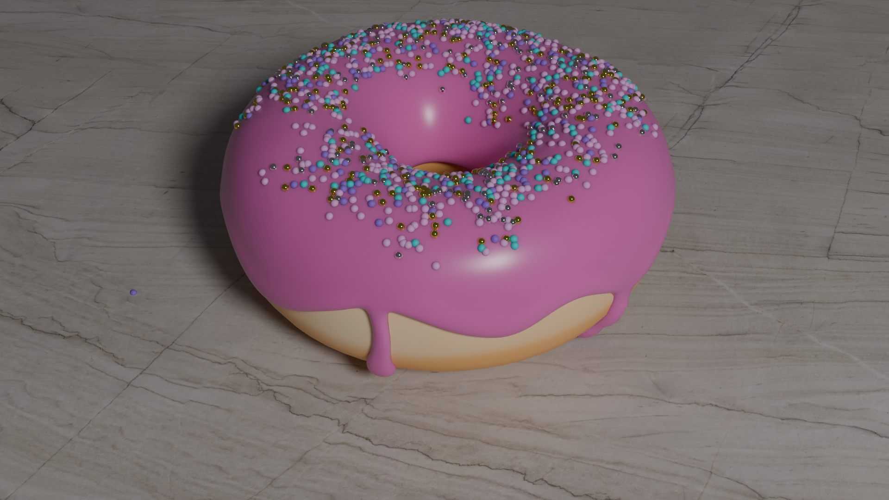
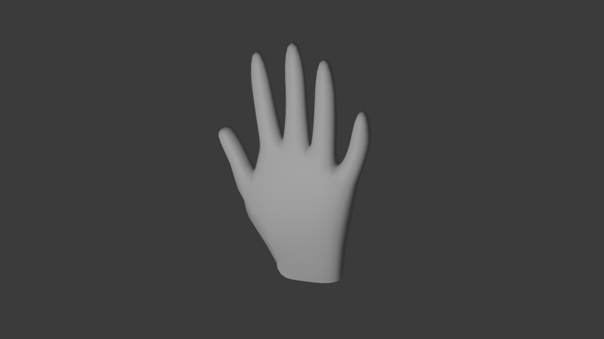
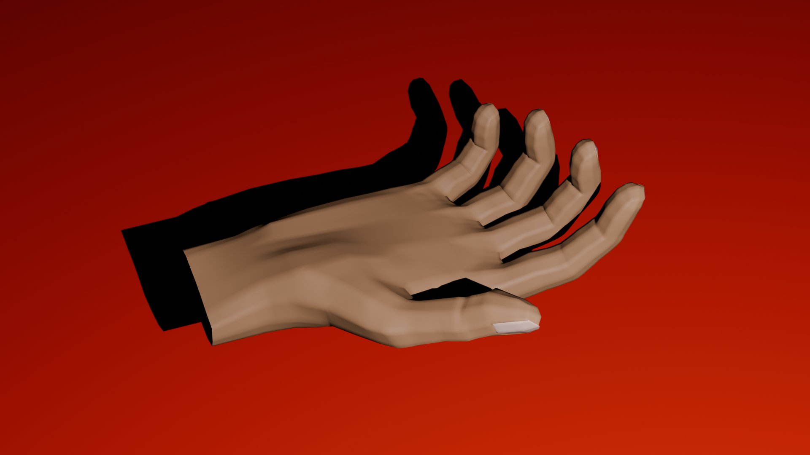

# Modelado y Animación de Mano en Blender para MyOreHab

## Descripción del Proyecto

Este proyecto fue desarrollado en el contexto de las prácticas de empresa de la carrera de Ingeniería Robótica, en colaboración con el grupo Human Robotics de la Universidad de Alicante. El objetivo principal fue la creación de un modelo de mano humana en Blender, capaz de realizar animaciones que sirvan como guía visual para pacientes en el proyecto MyOreHab. Los pacientes utilizarían estas animaciones para imitar movimientos específicos de la mano como parte de su proceso de rehabilitación.

## Estructura del Proyecto

El proyecto se divide en tres fases principales, cada una representada por una carpeta en el repositorio:

1. **Donut Tutorial**:
   - **Descripción**: Un modelado de un donut para familiarizarse con las herramientas básicas de Blender, siguiendo un tutorial en YouTube.
   - **Carpeta**: `donut_tutorial`
   - **Tutorial**: [Donut Tutorial en YouTube](https://youtu.be/B0J27sf9N1Y?si=I66uXb5myvBVIiyr)

2. **Modelo de Mano Simple**:
   - **Descripción**: Un primer intento de modelado de una mano, sin detalles ni animación, también siguiendo un tutorial en YouTube.
   - **Carpeta**: `mano_simple`
   - **Tutorial**: [Tutorial de Mano Simple en YouTube](https://youtu.be/__H-gAxCDts?si=-oRYWrjbxJMW5hKn)

3. **Mano Final**:
   - **Descripción**: El modelado detallado y la animación de una mano completa, incluyendo rigging y la creación de varias animaciones. 
   - **Carpeta**: `mano_final`
   - **Archivos**:
     - `mano_sindetalles.blend`: Primer modelo de la mano sin detalles.
     - `mano_sinfondo.blend`: Modelo de la mano sin fondo.
     - `mano_fondo.blend`: Mano con fondo añadido.
     - `mano_final.blend`: Modelo final detallado de la mano.
     - `mano_final_pelota.blend`: Modelo final con una pelota de tenis para animación.
   - **Tutorial**: [Tutorial de Mano Final en YouTube](https://youtu.be/Qw_Xq5M2oF4?si=0oK1hnq22RlCgCWW)

## Herramientas y Técnicas Utilizadas

- **Blender 4.1**: Software utilizado para modelado, texturización, rigging y animación.
- **Sculpting**: Para esculpir detalles en la mano final.
- **Shader Editor**: Para la creación de materiales y texturas complejas.
- **Rigging y Armature**: Para dotar a la mano de un sistema de huesos y permitir la animación de movimientos realistas.

## Animaciones Creadas

En la mano final, se desarrollaron las siguientes animaciones:

1. **Abrir y Cerrar Mano**: Animación básica de la mano abriéndose y cerrándose.
2. **Abrir Dedos**: Animación en la que los dedos se abren individualmente.
3. **Tocar Dedos con Pulgar**: Animación del pulgar tocando cada uno de los dedos.
4. **Apretar una Pelota**: Animación de la mano apretando una pelota de tenis.

## Requisitos

- **Software Necesario**: Blender 4.1 o superior.
- **Configuración Adicional**: No se requiere configuración adicional; los archivos `.blend` están listos para ser abiertos y editados.

## Imágenes y Videos

### Donut Modelado

### Mano Simple

### Mano Final

### Animaciones
A continuación se muestra una animación de la mano final:
[Enlace al video o GIF de la animación](mano_final/animaciones/dedospulgar.mp4)

## Licencia

Este proyecto está licenciado bajo la [MIT License](LICENSE).

## Créditos

- **Tutoriales**: 
  - [Blender Donut Tutorial](https://youtu.be/B0J27sf9N1Y?si=I66uXb5myvBVIiyr) por Blender Guru.
  - [Mano Simple](https://youtu.be/__H-gAxCDts?si=-oRYWrjbxJMW5hKn) por PIXXO 3D.
  - [Mano Final](https://youtu.be/Qw_Xq5M2oF4?si=0oK1hnq22RlCgCWW) por SilverWilliam 3D Artist.
- **Desarrollador**: [Santiago Limorte](https://www.linkedin.com/in/limortesantiago/)

## Contacto

Para cualquier consulta sobre este proyecto, puedes contactar a través de [limortesantiago@gmail.com].

